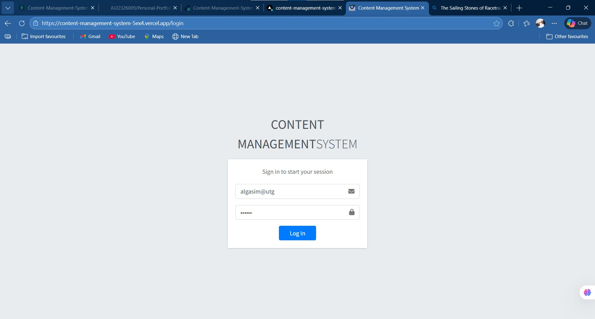
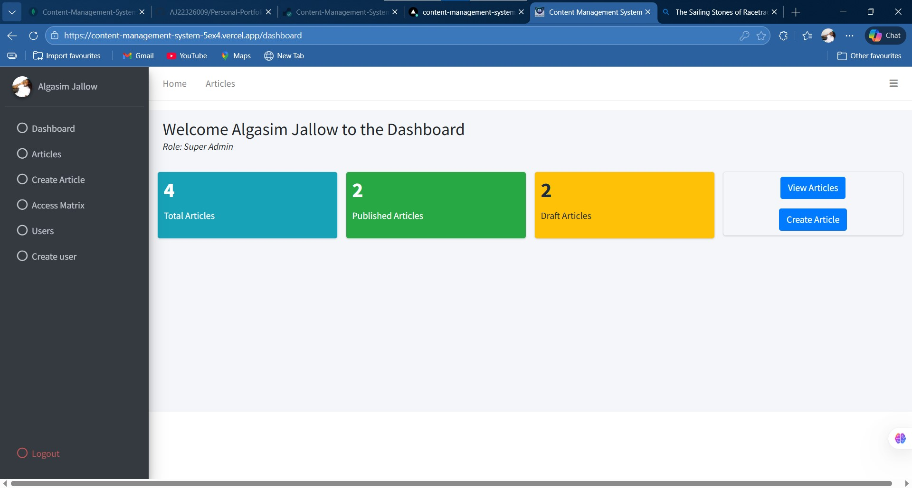
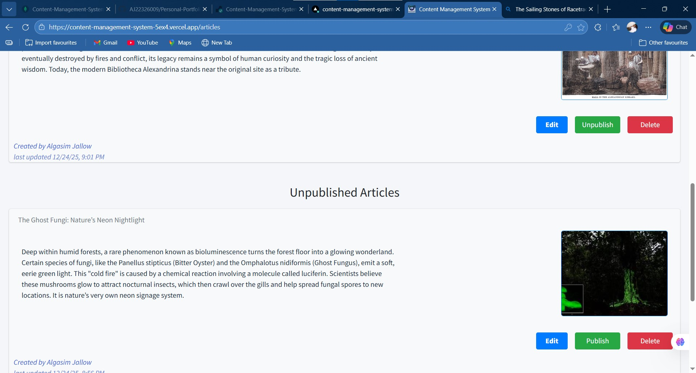
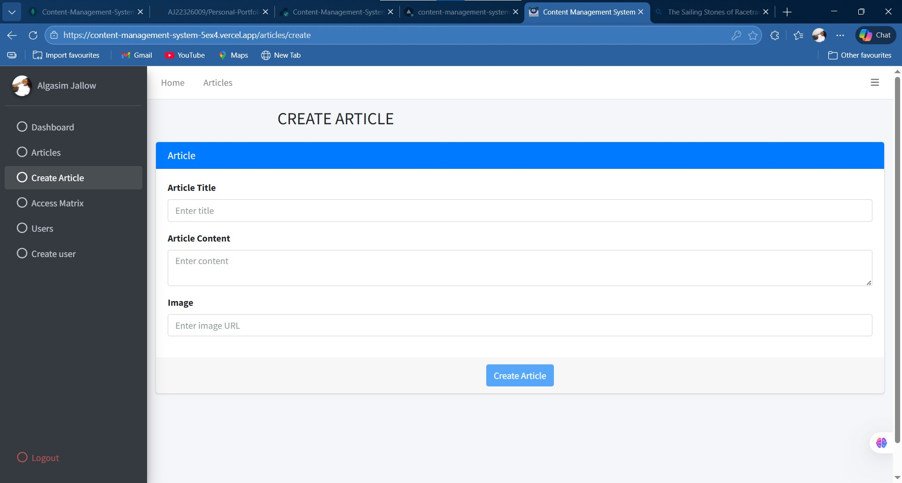
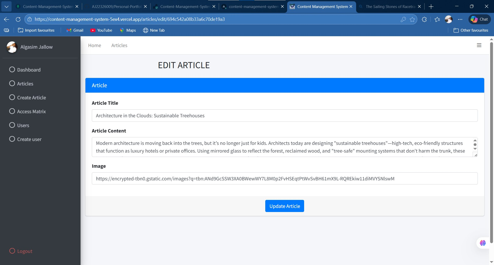
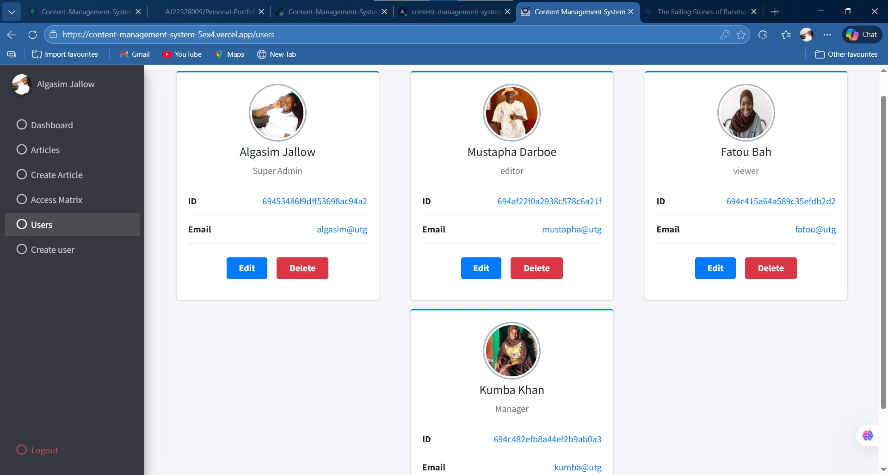
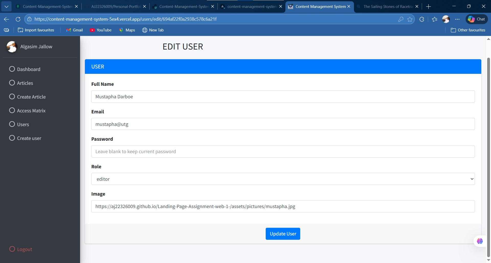
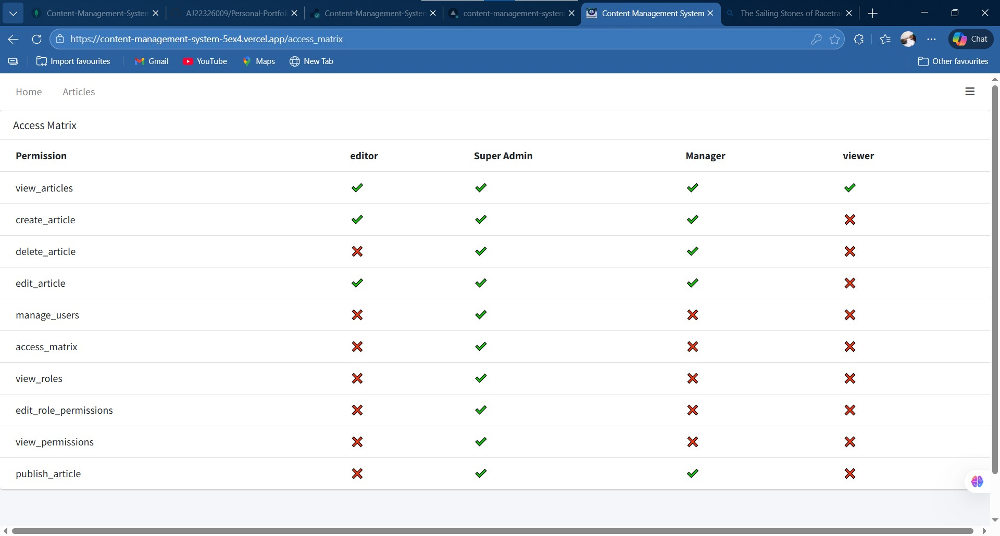

# Content-Management-System

## Overview
This is a mid-term project for my Web2 course (lecturer: Mr. Pa Sulay Jobe). It aims to demonstrate our knowledge in fullstack web development especially role based access control.
- Name: Algasim Jallow
-Mat#: 22326009

## Features
- JWT Authentication (Access + Refresh tokens)
- Role-Based Access Control
- Access Matrix
- Article Management (Create, Edit, Publish, unpublish, delete)
- User Management (create, edit, delete)
- Protected Routes & UI
- Both access and refresh token used
- access token expires in 15 mins
- Auto logout on token expiry

## Tech Stack
Frontend: Angular  
Backend: Node.js, Express  
Database: MongoDB
Styling: AdminLTE CLI

## Setup Instructions
### Backend
- npm install
- create .env
- npm run dev

### Frontend
- npm install
- ng serve

## Environment Variables [For lecturer Only]
**Please view Environment Variables in google classroom submitted doc**

## API Endpoints

### Article endpoints
- **POST** /api/articles/ => *creates an article*
- **GET** /api/articles/ =>  *gets all articles*
- **GET** /api/articles/:id => *getS an article*
- **PUT** /api/articles/:id => *edits an article*
- **DELETE** /api/articles/:id => *deletes an article*
- **PUT**  /api/articles/:id/publish => *publishes an article*

### Permissions endpoints
- **GET** /api/permissions/ =>  *gets all permissions*

### Roles endpoints
- **GET** /api/roles/ =>  *gets all roles*

### Users endpoints
- **POST** /api/users/register =>  *registers a user to the db*
- **GET** /api/users/ =>  *get all users*
- **GET** /api/users/:id =>  *get a user*
- **DELETE** /api/users/delete/:id =>  *delete a user*
- **PUT** /api/users/update/:id =>  *updates a user*

### Login endpoints
- **POST** /api/auth/login =>  *login a user*
- **POST** /api/auth/refresh =>  *refresh a user*
- **POST** /api/auth/login =>  *logout a user*

## Test Accounts [For lecturer only]
**Please View test accounts in google classroom submitted doc.**

## Deployment
- Frontend: <https://content-management-system-5ex4.vercel.app/>  (Vercel)
- Backend: <https://content-management-system-tqb3.onrender.com/> (Render)

*NOTE:*

For the Backend API:
- Accessing the base URL directly in a browser may show a blank page or error.
- API endpoints must be accessed via the frontend or using tools like Postman with a valid token.

## Screenshots of pages

### login page

### Dashboard (home) Page

### Articles Page

### Create Article Page

### Edit Article Page

### Users Page

### Create User Page

### Articles Page

### Access Matrix Pages (shows all the roles and the permissions given to each role - only visible to Super Admin)
